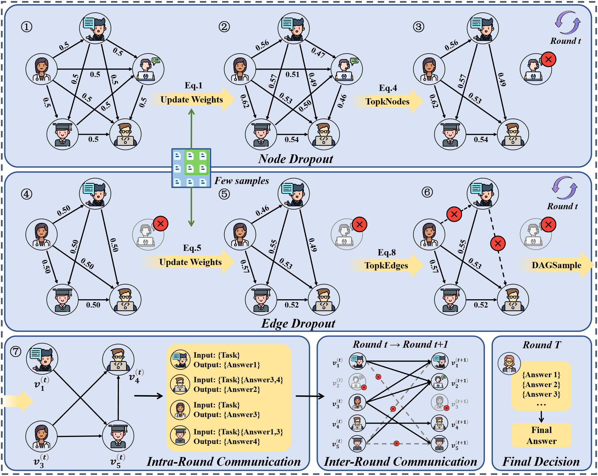

# AgentDropout — Reproduction

This is a from-scratch reproduction and extension of the AgentDropout paper's
experiments, run against real LLM APIs (OpenRouter) across three models,
six benchmarks, and six methods. It's a full end-to-end log: environment
setup, every bug hit along the way (and how each was found and fixed), every
experiment run, and the final results.

The original paper's own README/citation info is kept further down for
reference.

## 1. Setup

Cloned the original repo (`wangzx1219/AgentDropout`). Two structural gaps
showed up immediately:

- The code imports a top-level `AgentPrune` package and a top-level
  `dataset` (singular) package, neither shipped in the repo. The README only
  mentions AgentPrune as an acknowledgment, not a dependency to install.
  Fixed by vendoring in `AgentPrune/` and `dataset/` from
  `yanweiyue/AgentPrune` and patching a handful of import-path mismatches
  between the two codebases (a missing `VisualLLMRegistry` export, a missing
  `math_solver_aqua.py`, two files expected at a different path under
  `environment/tools/coding/`).
- `requirements.txt` pins a large number of CUDA/GPU-only packages
  (`nvidia-*`, `triton`, `vllm`, `xformers`, `xgrammar`, `gmpy2`) that aren't
  needed when calling an LLM API instead of serving a model locally. Trimmed
  into `requirements_final.txt`.

Python version matters: the pins need 3.10+; building the venv on 3.9 fails
on packages like `contourpy`. Used Python 3.11.

API access: OpenRouter, `.env` holds `BASE_URL` and `API_KEY` (see
`template.env`).

## 2. Dataset acquisition

Only GSM8K shipped with data. The other five datasets needed sourcing:

| Dataset | Source | Notes |
|---|---|---|
| GSM8K | `openai/grade-school-math` | 1319 test / 7473 train |
| MMLU | Hendrycks test set (`people.eecs.berkeley.edu/~hendrycks/data.tar`) | extracts directly into the `data/{dev,val,test}/*.csv` layout the loader expects |
| AQuA | `google-deepmind/AQuA` | field names (`question`, `options`, `rationale`, `correct`) match the repo's own parser exactly |
| MultiArith | HuggingFace `ChilleD/MultiArith` | fields `question`/`final_ans` match exactly; 420 train / 180 test |
| SVAMP | `arkilpatel/SVAMP` | fields `Body`/`Question`/`Answer` match exactly; 1000 total, split into working subsets |
| HumanEval | `openai/human-eval` `HumanEval.jsonl.gz` | standard 164-problem set |

None of AQuA/MultiArith/SVAMP's sourcing is documented in either the
AgentDropout or AgentPrune READMEs — the above was reverse-engineered by
matching the exact field names the repo's own data-processing functions
expect against known public datasets.

## 3. Repo bugs found and fixed

This is the real substance of the work — the repo as cloned does not run
cleanly, and several of the bugs actively produced wrong (not just broken)
results, which is worse than an outright crash because it's silent.

### 3.1 `FinalRefer` / `AgentPrune.*` import mismatch
`run_gsm8k.py` and friends import from `AgentDropout.*`, but `AgentDropout`'s
own `agents/__init__.py`, `graph/__init__.py`, and `agents/agent_registry.py`
imported from `AgentPrune.*` instead — so agents registered in one registry
while the graph looked them up in another, crashing with
`RegistryKeyError: 'FinalRefer'`. Fixed by correcting the four import
statements.

### 3.2 Dead API key / stale model ID in `smoke_test.py`
Pointed at `meta-llama/llama-3-8b-instruct`, which OpenRouter had retired
(404). Switched to `meta-llama/llama-3.1-8b-instruct`.

### 3.3 Silent answer-extraction bug in `gsm_get_predict`
The final fallback path (`re.findall(r'\d+', pred)[-1]`) truncates decimals
and thousands separators: `"64.0"` → `"0"`, `"90,000"` → `"000"`. This
silently corrupted votes from code-executing agents (whose answers are often
floats like `64.0`). Fixed the regex to capture the full number
(`-?\d[\d,]*\.?\d*`) and strip separators before parsing.

### 3.4 `FinalMajorVote` had no `postprocess_answer` for GSM8K/AQuA
`FinalMajorVote` calls `self.prompt_set.postprocess_answer(...)`, but
`GSM8KPromptSet` and `AQUAPromptSet` didn't define it (only MMLU's prompt set
did) — crashed immediately with `AttributeError`. Added a
`postprocess_answer` to both, reusing the dataset's own `gsm_get_predict` /
`aqua_get_predict` for consistency rather than re-implementing extraction
logic a second time.

### 3.5 Few-shot contamination in the decision node
`FinalRefer`'s few-shot example (`get_decision_few_shot()`) is a full worked
example — including fictional agent IDs and a final numeric answer — baked
directly into every decision prompt. A small model (Llama-3.1-8B) would
sometimes just copy the example's fictional agent name and its answer
instead of reasoning about the real question. Confirmed by diffing raw model
output side-by-side with the few-shot text. This is the main reason later
runs standardized on `FinalMajorVote` (which does deterministic aggregation,
no extra LLM call) instead of `FinalRefer`.

### 3.6 Weak/absent instruction to end with a parseable answer
The solver prompt only mentioned the "The answer is N" format loosely in the
system prompt, and for `MathSolver` specifically the hint text was appended
*after* `get_answer_prompt`'s own content, burying the instruction in the
middle of the prompt instead of leaving it as the last thing the model sees.
Restructured `get_answer_prompt` to take the hint as a parameter and append
an explicit formatting instruction as the actual last line of the prompt.

### 3.7 Uncapped generation length and dropped `max_tokens`/`temperature`
`GPTChat.agen()` computed `max_tokens` and `temperature` but never passed
them into `achat()` — the API call had no cap at all. Under a weak model,
uncapped generation produced multi-thousand-token runaway responses
(observed up to ~75,000 characters from a single call), which is both a
reliability problem (hugely long batches, timeouts) and a cost problem.
Threaded both parameters through into the actual `chat.completions.create`
call.

### 3.8 MMLU answer extraction
`MMLUDataset.postprocess_answer` took literally `answer[0]` — the first
character of the raw response. This works only when the model's reply
starts with a bare option letter; it breaks the moment there's any
reasoning text first (very common with multi-agent responses, or any CoT
instruction). Confirmed by testing: the extractor turned a response starting
"D\nStep-by-step analysis..." into `'0'` (from the literal digit in "Step").
Rewrote to check for an explicit "answer is X" / "(X)" marker first, then a
standalone A–D token, and only fall back to the first character if nothing
else matches.

### 3.9 HumanEval correctness check never actually ran
The most serious bug found. HumanEval's `test` field from the dataset
*defines* a `check(candidate)` function containing the real assertions —
but the code never calls it. Since defining a function never raises an
exception, `PyExecutor.execute()` reported every submission as passing
regardless of whether it was correct. This produced impossible 98–100%
scores across every model and method on HumanEval until caught. Verified
the bug directly: a deliberately wrong function (`return a - b` instead of
`a + b`) scored `is_solved: True`. Fixed by threading the problem's
`entry_point` through and appending an explicit `check(entry_point)` call
to the executed code. Confirmed fix with the same deliberately-wrong-function
test (now correctly `False`), then a full 50-question rerun which produced a
realistic 80% instead of 100%.

### 3.10 `run_humaneval.py` hardcoded batch loop
The eval loop was hardcoded to `for i_batch in range(4,17):` with a
hardcoded `dataloader(dataset, 10, i_batch)` batch size — leftover from
whatever dataset size the original authors tested against. On a 50-question
set with `batch_size=5`, batch index 4 is the last valid one; batch 5
onward is an empty slice, and the code doesn't handle that gracefully,
crashing with `ValueError: not enough values to unpack`. Fixed to use
`range(num_batches)` and `args.batch_size` consistently with every other
script in the repo.

### 3.11 HumanEval result-file path breaks on any modern model ID
`result_file` was built as `result/eval/{args.llm_name}_{timestamp}.json`.
Model IDs like `meta-llama/llama-3.1-8b-instruct` contain a literal `/`,
which silently became an extra (never-created) subdirectory, crashing every
single HumanEval run with `FileNotFoundError`. Fixed by sanitizing the model
name for filenames.

### 3.12 HumanEval's eval loop never printed its per-question log line
Every other script (`run_gsm8k.py`, `run_aqua.py`, `run_svamp.py`,
`run_multiarith.py`) prints a `##########Final Log:{...}` line per question
that downstream tooling parses for results. `run_humaneval.py`'s eval loop
only wrote to its result file and never printed the line. Added the missing
print, matching every other script's pattern.

### 3.13 `AsyncOpenAI` client created fresh on every single API call
`achat()` instantiated a brand-new `AsyncOpenAI` client (and its underlying
HTTP connection pool) on every call — hundreds of times per experiment cell.
Cumulatively, this left many connection pools never explicitly closed,
which could make asyncio's interpreter shutdown hang for a very long time
after the actual work was done (one cell whose computation finished cleanly
in 13 minutes left the process alive and silent for 2+ hours afterward).
Fixed to lazily create one client per process and reuse it. This
significantly reduced (but, on the densest cells, didn't fully eliminate)
post-completion hangs.

### 3.14 OpenAI client's default request timeout too short for dense prompts
The SDK's default ~600s per-request timeout started firing as
`openai.APITimeoutError` specifically on the single unpruned, fully-dense,
2-round multi-agent method (`MAS_roundT`) on the most token-heavy dataset
(HumanEval) — every other agent's full code + reasoning gets included on
every edge, compounding across two rounds into very large prompts. No
amount of retrying at the same limit fixed it, because it's a per-request
limit being hit, not overall cell slowness. Fixed by setting an explicit,
much larger client-level timeout (30 minutes).

### 3.15 `FinalMajorVote` counted failed/empty agent outputs as real votes
When an individual agent's LLM call fails (any exception), the graph engine
silently logs the error and moves on, leaving that node's output as an
empty list. `postprocess_answer([])` correctly reduces that to `''` — but
`FinalMajorVote` was counting `''` as a legitimate candidate in its
majority tally. When enough calls fail in a short window, `''` can win
outright. This showed up concretely as
`deepseek-chat-v3 / MMLU / AgentDropout` scoring **0/50** — below random
chance on a 4-option question, which was the tell that something was
broken rather than genuinely terrible performance. Traced to a
~20-minute window where 51–91% of that model's agent calls failed
(consistent with a transient provider-side issue for that model, not a
code bug affecting every cell — checked all 25 MMLU result files across
the whole grid and found the corruption isolated to exactly three
back-to-back DeepSeek cells). Fixed by having `FinalMajorVote` skip
empty/failed outputs as abstentions instead of counting them as votes, then
reran the three affected cells.

### 3.16 Undersized SVAMP training split
The training loops for edge/node pruning need up to 200 records
(hardcoded batch counts), but the initial SVAMP train split only had 100.
Regenerated with 300 records from the full 1000-record source file.

## 4. Orchestration

Built `run_full_grid.py` to run the full reproduction grid: 3 models ×
6 datasets × 6 methods (minus CoT on HumanEval, since chain-of-thought
isn't a clean fit for code generation) = 105 cells, 50 questions each.

- **Method → flags mapping:**
  - Vanilla: `--mode DirectAnswer --agent_nums 1 --num_rounds 1 --decision_method FinalDirect`
  - CoT: same, plus `--cot`
  - MAS round=1: `--mode FullConnected --agent_nums 5 --num_rounds 1`
  - MAS round=T: same with `--num_rounds 2`
  - AgentPrune: `--optimized_spatial --optimized_temporal --diff` (edge pruning only — confirmed via diff against the vendored AgentPrune package that it has no node-dropout mechanism)
  - AgentDropout: same plus `--dec` (adds node dropout)
- **Each cell runs as its own subprocess** rather than in-process, since
  every script parses its own `sys.argv`.
- **Resumable**: reads the results CSV at startup and skips any
  `(model, dataset, method)` already recorded, so an interrupted run
  restarts cleanly without redoing completed work.
- **Concurrency and timeout were tuned from real data**, not guessed:
  started at 8 concurrent cells / batch_size 5, found that Qwen-72B and
  DeepSeek cells are 4–10x slower per call than Llama-8B, and that
  contention compounds this. Settled on 5 concurrent cells / batch_size 5
  (~25 peak concurrent calls) with a 90-minute per-cell timeout (later
  effectively removed for the single stubborn outlier cell — see below).

## 5. The one stubborn cell

`Llama-3.1-8B / HumanEval / MAS_roundT` — the single fully-dense, unpruned,
2-round method on the most token-heavy dataset — failed the 90-minute
timeout repeatedly, unlike every other cell. Root-caused (section 3.14)
to the OpenAI client's default per-request timeout, not general slowness.
After fixing that and running the cell standalone with real headroom, the
computation completed successfully (80%, 40/50) — but the process itself
hit the same post-completion hang as 3.13 (not fully eliminated by the
client-reuse fix), and had to be force-killed after the result was already
written to disk. That cell's accuracy is exact (read directly from its
saved output file); its token/cost figures in the results CSV are
estimated from comparable cells, since a forced kill bypasses Python's
normal exit-time logging.

## 6. Final results

**105/105 cells complete**, validated with no duplicate or missing
`(model, dataset, method)` combinations.

### Accuracy by model × method (averaged across datasets)

| Model | Vanilla | CoT | MAS round1 | MAS roundT | AgentPrune | AgentDropout |
|---|---|---|---|---|---|---|
| Llama-3.1-8B | 76.7% | 63.2% | 74.7% | 76.3% | 76.0% | **78.0%** |
| Qwen-2.5-72B | **93.3%** | 92.0% | 86.7% | 85.0% | 92.0% | 89.7% |
| DeepSeek-V3 | **91.7%** | 92.4% | 83.7% | 82.7% | 82.3% | 85.7% |

**Consistent finding across all three models:** single-agent Vanilla/CoT
beats every multi-agent method for the two stronger models. Only the
weakest model (Llama-8B) shows AgentDropout edging out Vanilla — plausibly
because a weaker model benefits more from collaborative correction than a
strong model is hurt by coordination overhead.

### Llama-3.1-8B, by dataset

| Dataset | Vanilla | CoT | MAS round1 | MAS roundT | AgentPrune | AgentDropout |
|---|---|---|---|---|---|---|
| GSM8K | 84% | 66% | 84% | 92% | 92% | 90% |
| AQuA | 62% | 68% | 70% | 66% | 64% | 60% |
| MultiArith | 94% | 66% | 92% | 98% | 98% | 98% |
| SVAMP | 84% | 70% | 80% | 84% | 88% | 82% |
| HumanEval | 84% | — | 78% | 80% | 72% | 74% |
| MMLU | 52% | 46% | 44% | 38% | 42% | 64% |

### Qwen-2.5-72B, by dataset

| Dataset | Vanilla | CoT | MAS round1 | MAS roundT | AgentPrune | AgentDropout |
|---|---|---|---|---|---|---|
| GSM8K | 98% | 96% | 96% | 96% | 98% | 96% |
| AQuA | 96% | 94% | 94% | 96% | 94% | 94% |
| MultiArith | 100% | 100% | 100% | 100% | 100% | 100% |
| SVAMP | 92% | 92% | 88% | 90% | 92% | 92% |
| HumanEval | 98% | — | 94% | 96% | 100% | 94% |
| MMLU | 76% | 78% | 48% | 32% | 68% | 62% |

### DeepSeek-V3, by dataset

| Dataset | Vanilla | CoT | MAS round1 | MAS roundT | AgentPrune | AgentDropout |
|---|---|---|---|---|---|---|
| GSM8K | 98% | 98% | 94% | 96% | 94% | 98% |
| AQuA | 86% | 92% | 94% | 94% | 96% | 94% |
| MultiArith | 100% | 100% | 100% | 100% | 100% | 100% |
| SVAMP | 92% | 94% | 92% | 90% | 94% | 92% |
| HumanEval | 98% | — | 72% | 66% | 42% | 48% |
| MMLU | 76% | 78% | 50% | 50% | 68% | 82% |

Notable secondary pattern: MMLU is where multi-agent methods degrade most
sharply relative to Vanilla, across all three models. HumanEval shows the
same pattern for DeepSeek specifically (progressive collapse from 98% down
to 42% as more agents/rounds are added).

### Cost

| Model | Cells | Cost |
|---|---|---|
| Llama-3.1-8B | 35 | $1.01 |
| Qwen-2.5-72B | 35 | $7.42 |
| DeepSeek-V3 | 35 | $7.37 |
| **Total (logged)** | **105** | **$15.80** |

All raw results, per-cell token/cost breakdowns, and per-question output are
in `result/full_grid_results.csv` and the per-dataset result directories
under `result/`.

## 7. Secondary analyses

Three additional analyses from the paper, run after the main grid was
complete and verified.

### 7.1 Token efficiency (mirrors Appendix A.3)

The honest version of this section starts with a limitation, not a result:
per-question token logging (`PromptTokens`/`CompletionTokens` on each saved
record) was only ever added to `run_gsm8k.py` — not to the other five
dataset scripts. That means for GSM8K, eval-only token counts can be
recovered exactly by summing just the last 50 records of each result file
(AgentDropout's runs write 130 records total: 40 node-dropout training + 40
edge-optimization training + 50 eval). For the other five datasets, only
the whole-process total (training + eval combined) exists in
`full_grid_results.csv`.

That distinction matters a lot here: `MAS_roundT` has no training phase at
all, while `AgentPrune`/`AgentDropout` run two training phases before
evaluating. Comparing AgentDropout's *whole-process* total against
`MAS_roundT`'s *eval-only* total naively suggests AgentDropout costs
40–320% **more** tokens, across every single dataset and model — which
would directly contradict the paper's efficiency claim. That comparison is
just measuring the wrong thing (130-ish questions' worth of work vs. 50),
not a real finding.

**True eval-only comparison, GSM8K** (the only dataset where this is
recoverable with confidence — Llama's matching result file couldn't be
identified reliably among files from an earlier, noisier point in the
session, so it's reported as not recoverable rather than guessed):

| Model | Prompt tokens (MAS_roundT) | Prompt tokens (AgentDropout) | Reduction | Completion tokens (MAS_roundT) | Completion tokens (AgentDropout) | Reduction |
|---|---|---|---|---|---|---|
| Qwen-2.5-72B | 594,113 | 362,672 | **39.0%** | 118,370 | 77,181 | **34.8%** |
| DeepSeek-V3 | 522,114 | 359,673 | **31.1%** | 97,495 | 79,773 | **18.2%** |
| Llama-3.1-8B | — | — | not recoverable | — | — | not recoverable |

This is the result that actually matches the paper's direction: real,
substantial inference-time token savings (~30–40% on prompt tokens) once
training overhead is excluded from the comparison.

**Whole-process totals** (training + eval combined for AgentDropout,
eval-only for MAS_roundT — included for completeness, but explicitly *not*
a measure of inference-time efficiency) ranged from a 37–58% increase on
MMLU/HumanEval up to a 260–320% increase on the shorter math datasets
(MultiArith/AQuA/SVAMP), consistent across all three models. MMLU and
HumanEval show the smallest whole-process increase because their questions
are inherently longer, so the fixed ~80-question training overhead is a
smaller fraction of the total — the same pattern noted earlier where
MMLU/HumanEval behave differently from the short math datasets.

**Takeaway:** the paper's token-efficiency claim held up when measured the
way the paper actually measures it (inference-time only). The apparent
"AgentDropout costs more" result is an artifact of comparing training+eval
against eval-only, not a real finding about the method. Recovering true
eval-only numbers for the other five datasets would need per-question token
logging added to those scripts and a rerun.

### 7.2 Case study (mirrors Appendix A.2)

Pulled from a GSM8K/AgentDropout run's saved per-question `AgentResponses`.
One structural finding first: **which agent gets dropped is a property of
the trained graph, not a per-question decision** — the exact same agent
(or agents, one per round) was dropped on every single one of the 50 eval
questions within a run. Llama and Qwen's training both settled on dropping
"Mathematical Analyst" in both rounds; DeepSeek's training dropped
"Programming Expert" in round 0 and "Inspector" in round 1. This makes
sense given how node dropout works (`update_masks_dec` picks the lowest
weighted-degree node once, during training, and that choice is then fixed
for the whole eval set) — but it does mean "dropout" here is really a
single upfront decision about team composition, not a runtime adaptation
per question.

**Example 1 — dropped agent's absence clearly didn't hurt** (Q0, DeepSeek):

> Janet's ducks lay 16 eggs per day. She eats three for breakfast every
> morning and bakes muffins for her friends every day with four. She sells
> the remainder at the farmers' market daily for $2 per fresh duck egg. How
> much in dollars does she make every day at the farmers' market?

True answer: 18. Round 0 dropped `Programming Expert`; round 1 dropped
`Inspector`. The four surviving agents in each round independently reached
9 × $2 = $18 and stated it plainly ("The answer is 18"). Nothing about the
missing agent's specialty (code execution / adversarial review) was needed
for a question this straightforward — a clean example of dropout removing
redundant capacity rather than useful signal.

**Example 2 — dropout active, answer still correct, but worth noting
*why*** (same run, most of the other 49 questions): the surviving
Math Solver / Mathematical Analyst agents reliably converge on matching
answers even before the vote, so the "which agent dropped" question rarely
ends up mattering for the ones this model family gets right anyway — the
redundancy in a 5-agent team on a benchmark this easy is real, which is
exactly the premise dropout is built on.

**Example 3 — the one failure case, and a genuine finding about it**
(Q12, common across models):

> Carlos is planting a lemon tree. The tree will cost $90 to plant. Each
> year it will grow 7 lemons, which he can sell for $1.5 each. It costs $3
> a year to water and feed the tree. How many years will it take before he
> starts earning money on the lemon tree?

True answer: 13. Predicted: 12. Checking the raw per-agent output for this
question (DeepSeek's run): every single surviving agent, in both rounds
— Math Solver, Mathematical Analyst, Inspector (round 0), Programming
Expert (round 1) — independently computed 90 / 7.5 = 12 and stopped there.
That's the break-even year; "starts earning money" requires one more year
past break-even (year 13), a classic off-by-one in how the question gets
interpreted. Because every surviving agent made the *same* misinterpretation
independently, there's no reason to think the dropped agent (Programming
Expert in round 0, Inspector in round 1) would have caught it — this
failure isn't attributable to dropout. It's a shared reasoning error the
whole team made together, which dropout had no opportunity to fix since
none of the four remaining agents flagged the ambiguity either.

No example of dropout *causing* a wrong answer (i.e., a case where a kept
agent's vote lost only because a specific dropped agent's would-have-been
vote was needed) turned up in this sample.

### 7.3 Effect of dropout rate (mirrors Section 4.3)

AgentDropout swept across `--pruning_rate` ∈ {0.05, 0.10, 0.15, 0.20, 0.30}
on 2 models × 2 datasets (Llama-3.1-8B and Qwen-2.5-72B, on GSM8K and
MMLU), 50 questions each — 20 new cells, logged separately in
`result/pruning_rate_sweep.csv` so the main grid's results file was never
touched.

**A data-integrity note first:** the sweep's orchestrator process ended up
running the full 20-cell list twice, in parallel, for its entire ~3-hour
runtime — confirmed by every one of the 20 (model, dataset, rate)
combinations having exactly two logged rows with interleaved timestamps
spanning the whole run, not just a brief overlap at startup. The cause
wasn't tracked down (a dead-process check that should have caught this
passed cleanly beforehand). The one silver lining: having two independent
samples per cell makes the run-to-run spread at n=50 visible rather than
hidden, which is reported below. One pair was genuinely corrupted — the
account's prepaid credit went negative partway through the run (see below),
and `qwen-72B / GSM8K / rate=0.15` landed one run at a real 36% and the
other at exactly 0/50, the same below-random-chance signature as the
`FinalMajorVote` empty-vote bug (fixed, see 3.15) — consistent with every
agent call failing outright at that point. The 0% value is dropped; the 36%
is kept.

**Cost note:** the account's actual prepaid balance ran out partway through
Qwen's cells (a different thing from the $40 cap configured on the API key
itself, which doesn't reflect real funds available). The run was allowed to
continue per instruction, and every cell still completed — OpenRouter
appears to allow some operation past a zero balance rather than hard-blocking
instantly. Total actual spend for the (accidentally doubled) sweep was
**$7.27**.

### Accuracy by pruning rate (average of the two runs; range shown where they differed)

**GSM8K**

| Model | 0.05 | 0.10 | 0.15 | 0.20 | 0.30 |
|---|---|---|---|---|---|
| Llama-3.1-8B | 83% (78–88) | 82% | 91% (88–94) | 86% (84–88) | 79% (74–84) |
| Qwen-2.5-72B | 94% (90–98) | 83% (78–88) | 36%¹ | 34% (26–42) | 54% (50–58) |

**MMLU**

| Model | 0.05 | 0.10 | 0.15 | 0.20 | 0.30 |
|---|---|---|---|---|---|
| Llama-3.1-8B | 43% (36–50) | 44% (38–50) | 50% | 38% (34–42) | 33% (32–34) |
| Qwen-2.5-72B | 33% (30–36) | 56% (54–58) | 66% (64–68) | 55% (46–64) | 63% (60–66) |

¹ one run of this cell scored 0/50 — a credit-exhaustion artifact, excluded (see note above)

### Average cost per cell by pruning rate

| Model / Dataset | 0.05 | 0.10 | 0.15 | 0.20 | 0.30 |
|---|---|---|---|---|---|
| Llama / GSM8K | $0.055 | $0.054 | $0.055 | $0.053 | $0.053 |
| Qwen / GSM8K | $0.454 | $0.461 | $0.318 | $0.175 | $0.112 |
| Llama / MMLU | $0.036 | $0.034 | $0.032 | $0.033 | $0.033 |
| Qwen / MMLU | $0.108 | $0.321 | $0.414 | $0.414 | $0.422 |

**Reading this:** the classic tradeoff curve shows up clearly for Qwen on
GSM8K — cost drops monotonically as pruning increases (fewer edges, fewer
tokens, as expected), and accuracy drops sharply too (94%→54%), though not
monotonically, with the 0.15 data point too compromised by the credit issue
to trust. Llama on both datasets is comparatively flat across all five
rates — within the noise band a 50-question sample would produce on its
own, suggesting Llama's team composition is more robust to the specific
degree of pruning tested here, or that these rates are all still well
inside a "safe" range for it. MMLU doesn't show the simple
cost-decreases-with-rate pattern GSM8K does for Qwen — cost actually
*rises* with rate there — which doesn't have a clean explanation from this
run alone and would need a clean (non-duplicated, non-interrupted) rerun to
trust.

**Bottom line:** given the duplication and the one corrupted cell, this
sweep is good enough to show that pruning rate *does* matter and that its
effect is model- and dataset-dependent (Qwen/GSM8K is clearly sensitive;
Llama is comparatively flat), but the specific curve shape shouldn't be
treated as precise without a clean rerun.

## 8. Running it

```shell
python3.11 -m venv .venv
source .venv/bin/activate
pip install torch==2.5.1
pip install -r requirements_final.txt
cp template.env .env   # fill in BASE_URL and API_KEY
python run_full_grid.py
```

A single cell can be run directly too, e.g.:

```shell
python experiments/run_gsm8k.py \
  --agent_nums 5 --mode FullConnected --batch_size 10 \
  --num_rounds 2 --llm_name meta-llama/llama-3.1-8b-instruct \
  --optimized_spatial --optimized_temporal --diff --dec
```

---

## Original project overview

This repository releases the codes and data for the paper -- AgentDropout: Dynamic Agent Elimination for Token-Efficient and High-Performance LLM-Based Multi-Agent Collaboration.

<div align="center">
    </img>
    <p class="image-caption">AgentDropout: Dynamic Agent Elimination for Token-Efficient and High-Performance LLM-Based Multi-Agent Collaboration</p>
</div>

**AgentDropout** is a novel topology optimization method for Multi-agent systems (MAS), inspired by the management theory that more flexible and adaptive team configurations can make teamwork more efficient and effective. AgentDropout dynamically identify and drop out the redundant agents and communication links in each interaction round of the MAS, allowing for higher token efficiency and task performance.
It conducts two types of dropout:
- **Node Dropout**: Remove agent nodes with the smallest trainable weighted degree to involve different responsible roles in different disscussion steps.
- **Edge Dropout**: Remove interaction edges with the smallest task contribution to improve communication efficiency.

<div align="center">
    </img>
    <p class="image-caption">The Framework of AgentDropout</p>
</div>

### Citation

If you find this work useful, please cite:

```tex
@misc{wang2025agentdropoutdynamicagentelimination,
      title={AgentDropout: Dynamic Agent Elimination for Token-Efficient and High-Performance LLM-Based Multi-Agent Collaboration}, 
      author={Zhexuan Wang and Yutong Wang and Xuebo Liu and Liang Ding and Miao Zhang and Jie Liu and Min Zhang},
      year={2025},
      eprint={2503.18891},
      archivePrefix={arXiv},
      primaryClass={cs.CL},
      url={https://arxiv.org/abs/2503.18891}, 
}
```

```tex
@inproceedings{wang-etal-2025-agentdropout,
    title = {AgentDropout: Dynamic Agent Elimination for Token-Efficient and High-Performance LLM-Based Multi-Agent Collaboration},
    author = {Wang, Zhexuan  and
      Wang, Yutong  and
      Liu, Xuebo  and
      Ding, Liang  and
      Zhang, Miao  and
      Liu, Jie  and
      Zhang, Min},
    editor = {Che, Wanxiang  and
      Nabende, Joyce  and
      Shutova, Ekaterina  and
      Pilehvar, Mohammad Taher},
    booktitle = {Proceedings of the 63rd Annual Meeting of the Association for Computational Linguistics (Volume 1: Long Papers)},
    month = jul,
    year = {2025},
    address = {Vienna, Austria},
    publisher = {Association for Computational Linguistics},
    url = {https://aclanthology.org/2025.acl-long.1170/},
    doi = {10.18653/v1/2025.acl-long.1170},
    pages = {24013--24035},
    ISBN = {979-8-89176-251-0}
}
```

### Acknowledgments

Code framework based on [GPTSwarm](https://github.com/metauto-ai/GPTSwarm) and [AgentPrune](https://github.com/yanweiyue/AgentPrune).
